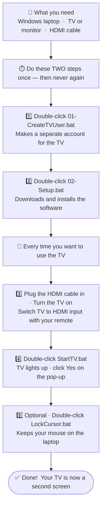

# Turn Your TV Into a Second Screen

Use your TV as a second screen for your Windows laptop — with its own separate desktop.

> **Watch the setup walkthrough:** *(screen recording coming soon)*

---

## What does this do?

You plug a cable from your laptop to the TV.
Your TV becomes a **second screen** — with its own taskbar, its own apps, its own desktop.
Your laptop stays exactly as it is. You work on your laptop normally.
Your mouse stays on the laptop. The TV runs on its own.

That's it.

---

## What do you need?

| What | Example |
|---|---|
| A Windows laptop or PC | Any Windows laptop from the last 10 years |
| A TV, monitor, or projector | Anything with an HDMI port on the back |
| A cable | HDMI cable — or a USB-C to HDMI adapter if your laptop has no HDMI port |

> **Not sure which cable?** Look at the side of your laptop. If you see a port that looks like a wide flat rectangle — that's HDMI, use an HDMI cable. If you only see small oval ports — those are USB-C, get a "USB-C to HDMI adapter" (under ₹500 / $6 on Amazon).

---

## How to set it up

---

## Something not working?

Double-click **CheckStatus.bat** — it checks everything and shows you exactly what is wrong in plain English.

For step-by-step fixes, see [TROUBLESHOOT.md](TROUBLESHOOT.md).

---

## File guide

| File | When | What it does in plain English |
|---|---|---|
| `01-CreateTVUser.bat` | Once | Creates a separate TV account on your computer |
| `02-Setup.bat` | Once | Downloads and installs the software that makes this work |
| `CheckStatus.bat` | Any time | Checks everything — shows green tick or red cross for each thing |
| `StartTV.bat` | Every time | Turns the TV on as a second screen and opens a Windows desktop on it |
| `LockCursor.bat` | Optional | Keeps your mouse on the laptop. Close the window to turn it off. |

---

## FAQ

**Do I need to be technical to set this up?**
No. Just double-click the files in order, one by one. Each one tells you what to do on screen.

**Will this break my laptop?**
No. If you ever want to undo everything, run `02-Setup.bat` and it has an uninstall option. Nothing permanent is changed.

**Does this work on Windows Home edition?**
Yes. Works on Windows 10 and 11, Home and Pro.

**My TV says "can't connect" or shows an error.**
See [TROUBLESHOOT.md](TROUBLESHOOT.md) — it lists every common error in plain English.

**After a Windows update, it stopped working.**
Run `StartTV.bat` again. It fixes itself automatically. If it says "try again tomorrow", just wait a day and run it again — it will work.

**Can I use a normal monitor instead of a TV?**
Yes. Any screen with an HDMI port works.

---

## How it works (for the curious)

Windows normally does not allow you to open a second desktop session on the same PC. This tool installs a small patch called **RDP Wrapper** that unlocks this. The TV connects to your laptop over a private internal cable (not the internet). Every time you run `StartTV.bat`, it also checks if Windows has updated and downloads any fixes automatically — so it stays working without you doing anything.

---

## License

[MIT](LICENSE) — free to use, share, and modify.
